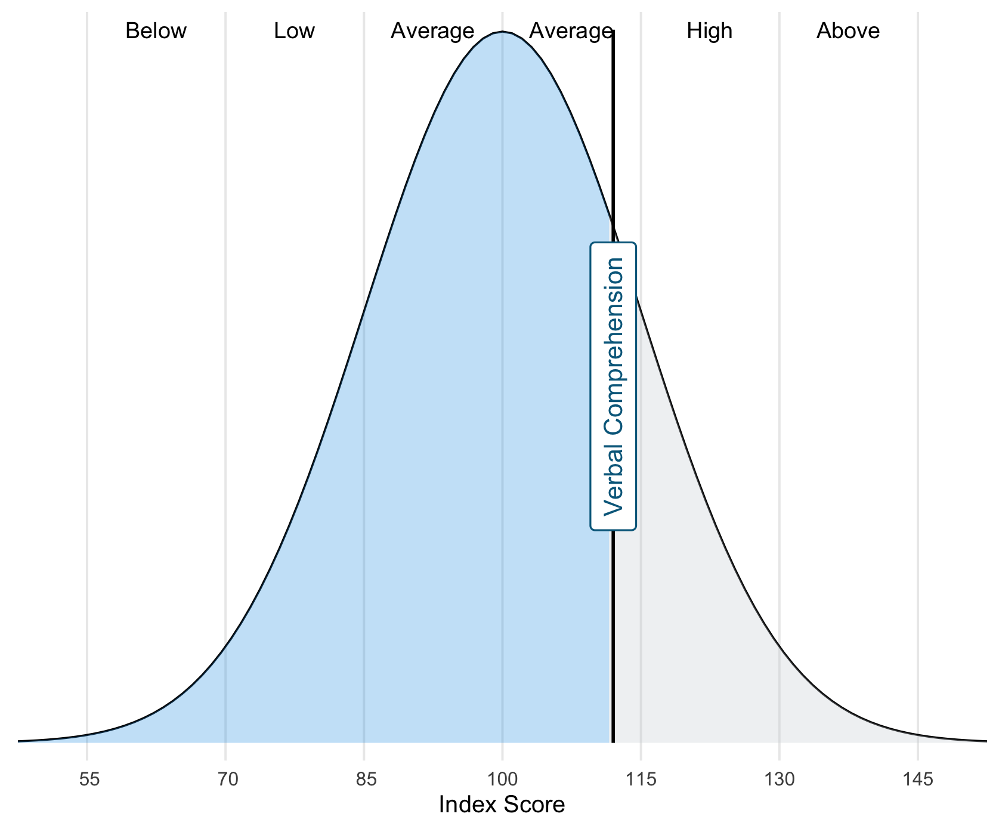

```{r, include=FALSE}
knitr::opts_chunk$set(echo = FALSE,
                      warning = FALSE,
                      tidy = FALSE,
                      message = FALSE,
                      fig.align = 'center',
                      out.width = "100%")
options(knitr.table.format = "html") 
```

# Introduction

Neuropsychologists spend `excessive time` deriving and interpreting cognitive test scores. As test publishers vary in the form of derived scores offered (e.g., Z score, T score, scaled score, etc) clinicians are required to work with multiple metrics simultaneously. Having a unified metric for interpreting test scores allows for clear and consistent tabulation. The use of a single metric also permits supplementary visual analysis as the chosen metric becomes the y-axis variable while the name of the test rests on the x-axis.

Unfortunately, to do this clinicians are required to convert scores, a process which can be error-prone, imprecise, and time-intensive. Furthermore, many clinicians do not feel confident in manually transforming test scores, particularly when lookup tables are not available. `Electronic tools` are required to streamline these processes and to provide access to visualisation functionality.

```{r, include=FALSE}
knitr::write_bib(c('posterdown', 'rmarkdown','pagedown', 'shiny'), 'packages.bib')
```

```{r, out.width='100%', fig.cap='Normal distribution curve developed using the web app.', fig.topcaption=TRUE}

```

## Aim

`Shiny` [@R-shiny] is a web application framework within the R and Python programming languages that enables the creation of interactive and dynamic web applications. The modest technical programming requirements means that applications can be designed by those with relatively limited programming experience. Apps can be hosted free of charge, while documentation and source code can be made publicly available through online repositories. To date there have been relatively few shiny apps developed for the field of clinical neuropsychology.

We plan to develop an app that allows users to convert single test scores (using the web interface) or large batteries of test results simultaneously (using spreadsheet upload).

```{r, out.width='100%', fig.cap='Radar plot patient level data for the WAIS-IV and CVLT-III', fig.topcaption=TRUE}

```

## Objectives

Develop a html web application that can:

1.  Convert among different test score metrics for a battery of test scores.
2.  Develop neuropsychology summary tables that are well formatted and dynamic.
3.  Allow users to develop data visualisations to help understand and communicate test results.

# Methods

Typically, clinicians use look-up tables for each administered test before compiling derived scores into a patient summary table. Although this workflow is favourable among clinicians, it can be time intensive, particularly when a large battery of tests has been used. There is also limited flexibility regarding which type of standard score can be reported, depending upon the metrics reported by publishers. Fortunately, standardised scores can be easily converted, from one score to another using the formula:

$$
X_{new} =
\frac{s_{new}}{s_{old}}
(X_{old} - \bar{X}_{old})
+ \bar{X}_{new}
$$ Where $X_{new}$ is the newly converted (or derived) score, $s_{new}$ and $s_{old}$ refer to the SD values for both new and old metrics, $\bar{X}_{new}$ and $\bar{X}_{new}$ are the mean values for the new and old metrics, and finally $\bar{X}_{old}$ is the original standard score.

# Results

`Score Converter` is a shiny app that allows users to convert single test scores (using a web interface) or large batteries of test results (using spreadsheet upload). A variety of derived score types and test descriptor systems are included, providing the user with the ability to develop customised test score summary tables. A suite of visualisation tools is then provided for developing static and interactive plots, these include `Forest Plots`, `Bar Plots`, `Bell Curve Plots`, and `Radar Plots`. All results can be exported to either csv, pdf, or png.

```{r, out.width='100%', fig.cap='Patient neuropsychology data summary table as made using the web app', fig.topcaption=TRUE}

```

# Conclusions

Score Converter provides proof of concept that simple convenience-focused web applications can be developed by clinicians with a small amount of experience in web development. Future empirical research needs to explore how visualisation and tabulation tools can aid, influence, or hinder the process of interpreting neuropsychological test data.

```{r, out.width='100%', fig.cap='Forest plot of patient neuropsychology test score data', fig.topcaption=TRUE}
knitr::include_graphics("img/promotion/poster/forest.png")
```

# Next steps

Future updates for `Score Converter` will include:

1.  Addition of reference lines (e.g., for pre-morbid estimate comparisons).
2.  Improved user interface that allows data input direct through the web app.
3.  Plot uncertainty levels around point estimates.

# References
